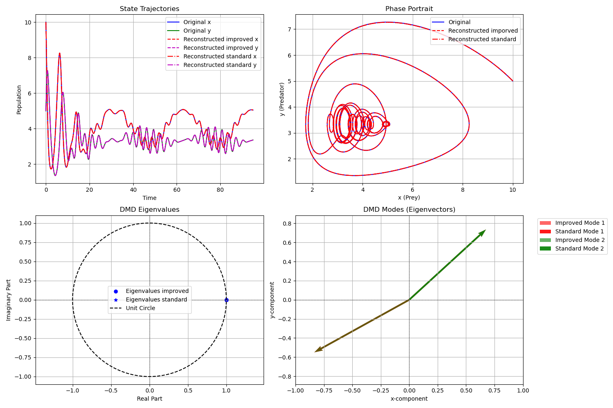
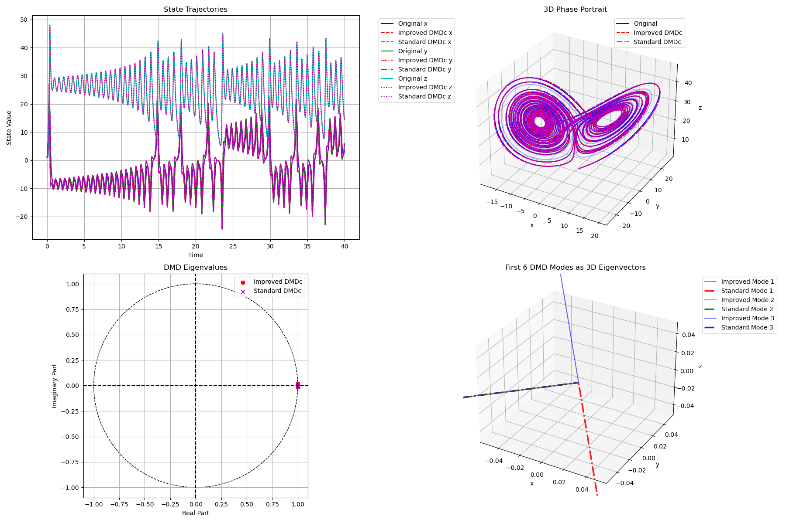
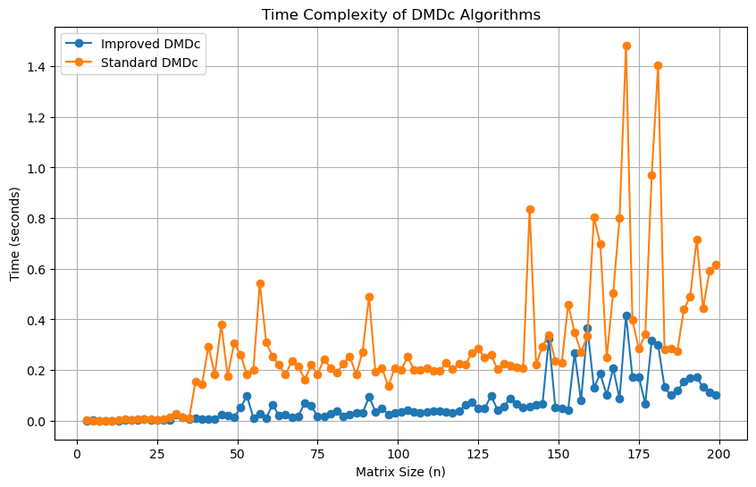

# Improved DMDC Implementation

This repository contains an implementation of the improved Dynamic Mode Decomposition with Control (DMDC) algorithm, as described in the paper:

+ Gyurhan Nedzhibov, "An Improved Approach for Implementing Dynamic Mode Decomposition with Control", Computation, 2023, 11(10), 201. DOI: 10.3390/computation11100201

The implementation focuses on the "mpc_controller" branch, which integrates DMDC with Model Predictive Control (MPC) for enhanced control of dynamical systems.

## Description
Dynamic Mode Decomposition with Control (DMDC) is a data-driven method for analyzing and modeling complex dynamical systems that are influenced by external control inputs. It extends the traditional Dynamic Mode Decomposition (DMD) by incorporating control signals, making it particularly useful for systems where external actuation plays a significant role.

This repository implements an improved version of DMDC, as proposed in the referenced paper. The key improvements include:

+ Computational Efficiency: The algorithm uses singular value decomposition (SVD) of lower-order matrices and reduces the number of matrix multiplications.

+ Simplified Structure: The resulting dynamic mode matrices have a simpler structure compared to the standard DMDC approach.

## Result
<!-- for lotka -->

<!-- for lorentz -->
 

<!-- benchmark time for helmert matrix -->

<!-- ## Idea -->

## Original DMDC (Algorithm 1)

The original DMDC algorithm approximates the models to $\mathbf{x}_{k+1} = A \mathbf{x}_k + B \mathbf{u}_k$ using snapshot data.

Data Setup:

Singular Value Decomposition (SVD):

Compute truncated SVD of $\Omega$ :

$$\Omega \approx \tilde{U} \tilde{\Sigma} \tilde{V}^*$$ 

where 

+ $\tilde{U} \in \mathbb{R}^{(n+q) \times p}$,

+ $\tilde{\Sigma} \in \mathbb{R}^{p \times p}$

+ $\tilde{V} \in \mathbb{R}^{m \times p}$

+ $p$ is the truncation rank.

Approximate System Matrices:

$$G \approx Y \tilde{V} \tilde{\Sigma}^{-1} \tilde{U}^* $$

where

+ $G = [A, B] \in \mathbb{R}^{n \times (n+q)}$.

So we can split 

$$\tilde{U} = \begin{bmatrix} \tilde{U}_1 \ \tilde{U}_2 \end{bmatrix}$$

Where:

+ $\tilde{U}_1 \in \mathbb{R}^{n \times p}$,

+ $\tilde{U}_2 \in \mathbb{R}^{q \times p}$.

Then:

$$A \approx \tilde{A} = Y \tilde{V} \tilde{\Sigma}^{-1} \tilde{U}_1^*$$

$$B \approx \tilde{B} = Y \tilde{V} \tilde{\Sigma}^{-1} \tilde{U}_2^*$$

Reduced-Order Model:

We need to have some projection matrix, which is independent from the control input, to represent our dynamics system in a new space. We can take it from column space of matrix $Y$ by computing SVD of $Y$: $$Y \approx \hat{U} \hat{\Sigma} \hat{V}^*$$

where $\hat{U} \in \mathbb{R}^{n \times r}$, $\hat{\Sigma} \in \mathbb{R}^{r \times r}$, $\hat{V} \in \mathbb{R}^{m \times r}$, and $r$ is the truncation rank.

Project matrices: 

$$\tilde{A}_r = \hat{U}^* \bar{A} \hat{U} \in \mathbb{R}^{r \times r} $$

$$ \tilde{B}_r = \hat{U}^* \bar{B} \in \mathbb{R}^{r \times q}$$

Dynamic Modes:

Compute eigenvalues $\Lambda$ and eigenvectors $W$ of $\tilde{A}_r$: $$\tilde{A}_r W = W \Lambda$$

DMD modes:

$$\Phi = Y \tilde{V} \tilde{\Sigma}^{-1} \tilde{U}_1^* \hat{U} W$$ 

## Alternative DMDC (Algorithm 2)

The alternative DMDC algorithm simplifies computations using a pseudoinverse approach.

Pseudoinverse Approach:

Compute the Moore-Penrose pseudoinverse of $\Omega$: $$\Omega^\dagger = [\Omega_1, \Omega_2]$$ 

where $\Omega_1 \in \mathbb{R}^{m \times n}$, $\Omega_2 \in \mathbb{R}^{m \times q}$.

So the idea is taking different projection matrix to find reduced model. We can extract that matrix from the $\Omega_1$, theoretically it shoud be independent from the input control action. 

We can rewrite the matrix $G$ to: 

$$G = Y \Omega^\dagger = [A, B]$$

Then we have: 

$$ A \approx \bar{A} = Y \Omega_1 $$

$$ B \approx \bar{B} = Y \Omega_2 $$

Also, we can compute reduced-Order SVD:

Compute SVD of $\Omega_1$: $$\Omega_1 \approx \tilde{U} \tilde{\Sigma} \tilde{V}^*$$

 where $\tilde{U} \in \mathbb{R}^{m \times r}$, $\tilde{\Sigma} \in \mathbb{R}^{r \times r}$, $\tilde{V} \in \mathbb{R}^{n \times r}$.

Then we can project the original transition matrix A into a new basis, defined by $\tilde{V}$ (which means we are projecting onto the row space of $\Omega_1$): 
$$\bar{A}_r = \tilde{V}^* \bar{A} \tilde{V}$$

$$\bar{B}_r = \tilde{V}^* \bar{B}$$

Then the dynamics mode of the system in new basis are:

Compute eigenvalues $\Lambda$ and eigenvectors $W$ of $\bar{A}_r$: $$ \bar{A}_r W = W \Lambda $$

DMD modes: $$\Phi = Y \tilde{U} \tilde{\Sigma} W$$

## Improved DMDC (Algorithm 3)

This is an improved version of Alternative DMDc. We note that to compute the pseudo-inverse matrix, it is usually necessary to perform some decomposition of the augmented matrix $\Omega$, such as SVD. Therefore, we can skip the pseudo-inverse step and directly extract the projection matrix from the SVD.

Compute SVD of $\Omega$: $\Omega \approx \tilde{U} \tilde{\Sigma} \tilde{V}^*$ 

where $\tilde{U} \in \mathbb{R}^{(n+q) \times p}$, $\tilde{\Sigma} \in \mathbb{R}^{p \times p}$, $\tilde{V} \in \mathbb{R}^{m \times p}$.

Compute pseudoinverse: $$\Omega^\dagger = \tilde{V} \tilde{\Sigma}^{-1} \tilde{U}^* = [\tilde{V} \tilde{\Sigma}^{-1} \tilde{U}_1 , \tilde{V} \tilde{\Sigma}^{-1} \tilde{U}_2]$$ 

Lower-Dimensional SVD:

Let $\bar{H} = \tilde{\Sigma}^{-1} \tilde{U}_1^* \in \mathbb{R}^{p \times n}$, where $\tilde{U}_1$ is the truncated first $n$ rows of $\tilde{U}$.

Compute SVD of $\bar{H}$: $$\bar{H} \approx \bar{U} \bar{\Sigma} \bar{V}^* $$ 

where $\bar{U} \in \mathbb{R}^{p \times r}$, $\bar{\Sigma} \in \mathbb{R}^{r \times r}$, $\bar{V} \in \mathbb{R}^{n \times r}$, and $r \leq \min(p, n)$.

Up to this point, we have obtained the projection matrix  $\bar{V}$, using just two SVDs, without the need for a pseudo-inverse. Also, the SVD of the matrix $\Omega_1$ is not necessarily unique. Since the ultimate goal is to obtain a projection matrix, it does not matter whether the projection matrix is unique or not. Then, the matrices $A$ and $B$ in the reduced model are:

$$\bar{A}_r = (\bar{V}) ^*  \bar{A} (\bar{V} )$$

$$\bar{B}_r = (\bar{V})^* \bar{B}$$

Then the dynamics mode of the system in new basis are:

Compute eigenvalues $\Lambda$ and eigenvectors $W$ of $\bar{A}_r$: $\bar{A}_r W = W \Lambda$

DMD modes:

$$\Phi = Y \bar{U} \bar{\Sigma} W$$ 

## Contributor

+ Quoc-Viet Pham

+ Xuan-Phuc Nguyen

+ Swahibath Saad

+ Ali Mohsin Hussain

+ Talha Sajid

## License

This project is licensed under the MIT License. See the LICENSE.md file for details.
Contact
For any questions, issues, or feedback, please contact:

Email: thexuanphuc@gmail.com

